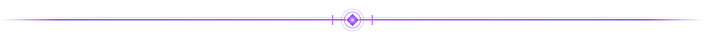
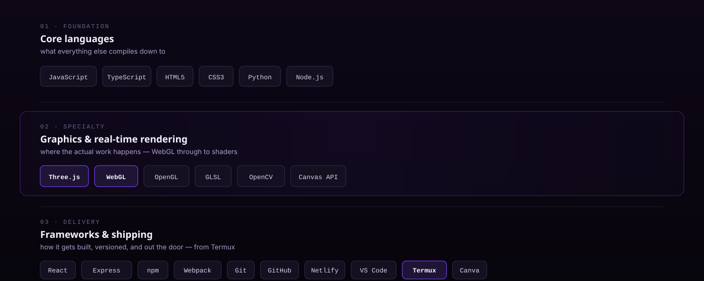
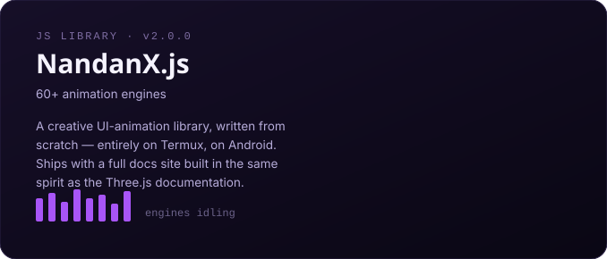

 

 

## `$` about

I build **interactive, real-time visual experiences** for the browser — mostly with Three.js and raw WebGL, mostly on a phone. My whole practice comes out of one constraint: everything I ship gets built and shipped from **Termux, on Android**. No desktop. No Electron. Just the web platform, doing real work, on hardware it wasn't really designed for.

That constraint shows up in how I write code, too. I don't reach for a framework I don't need. If a project can be one clean file that does exactly what it's supposed to and looks good doing it, that's the version I ship.

Lately that means going deep on **agentic engineering** — treating an AI model as a genuine collaborator in the build loop, not autocomplete. It's changed how fast I can move from *idea* to *rendering in the browser*, and it's part of how a solo, self-taught developer on a phone can ship things like a full IDE or a 3D engine wrapped around your own commit history.

 

 

## `$` ls ./stack

 

 

## `$` cat ./projects

 

<table>
<tr>
<td width="50%" valign="top">

</td>
<td width="50%" valign="top">

</td>
</tr>
</table>

 

OrinIDE → <a href="https://www.npmjs.com/package/orin-ide"><code>npmjs.com/package/orin-ide</code></a> · <a href="https://github.com/nandandas2407-web/orin-ide"><code>source</code></a>&nbsp;&nbsp;|&nbsp;&nbsp;more on <a href="https://nandandas369.netlify.app">the portfolio</a>

 

 

 

 

## `$` whoami --social

 

 

